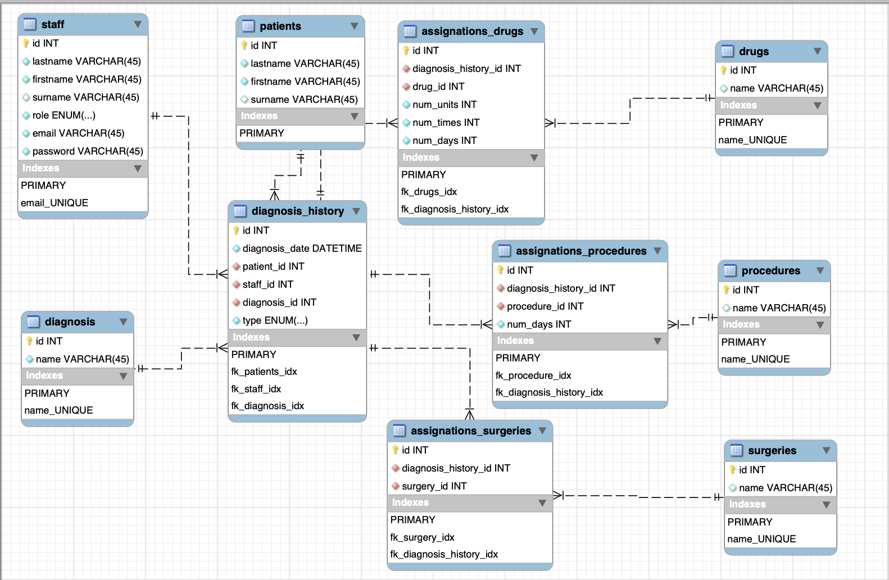

#Система Больница 

Врач определяет диагноз, делает назначение
Пациенту (процедуры, лекарства, операции). Назначение может выполнить
Медсестра (процедуры, лекарства) или Врач (любое назначение). Пациент
может быть выписан из Больницы, при этом фиксируется окончательный
диагноз.

##Database jdbc.model:
